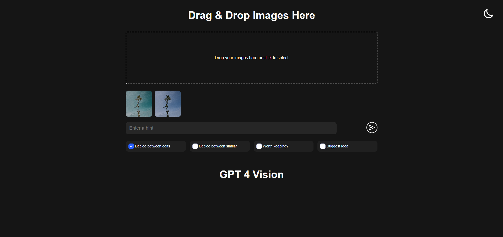
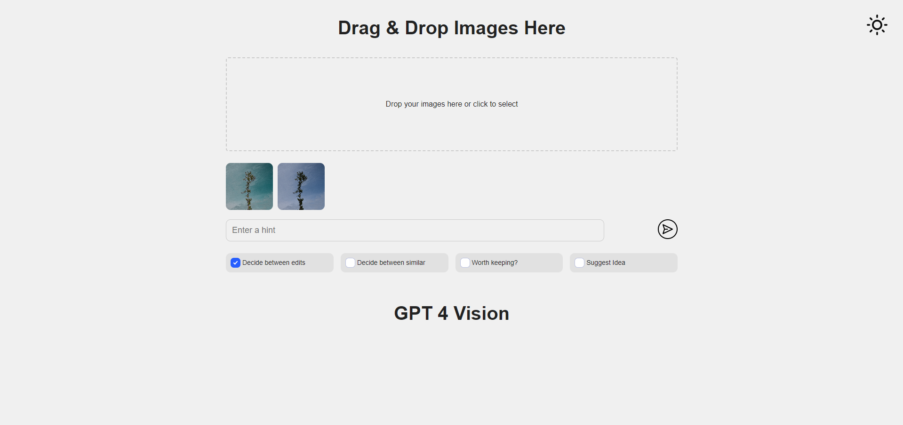
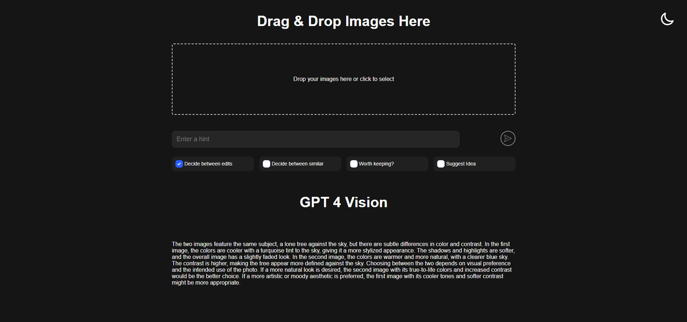
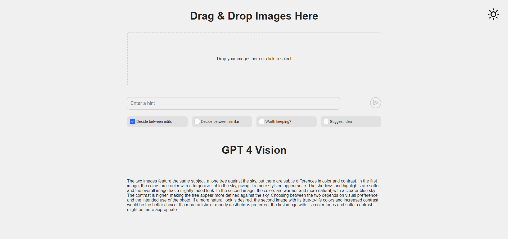

# Photo Guru

This web app helps you navigate your image editing workflow and make informed decisions with the help of GPT-4 Vision.

## Inspired by the Challenge of Choice

Ever struggled to choose between edits or decide if an image is worth keeping? Photo Guru was born from that very dilemma! It leverages the power of GPT-4 Vision (still in preview) to analyze your images and offer insights.

**Features:**

- **Decide between edits:** Can't decide between **multiple** edits of the same image? GPT 4 Vision will help you choose!
- **Decide between similar:** Not sure which one of the **multiple** similar images to keep? Let GPT 4 Vision compare and choose one of them for you.
- **Worth keeping?:** Unsure if an image deserves a spot in your collection? Get GPT-4 Vision's verdict.
- **Suggest Idea:** Need inspiration for editing a photo? Photo Guru can suggest editing goals or offer tips to achieve your vision.

**Adding Context to Images**

Provide additional context for your images using the "Caption" box. This helps GPT-4 Vision understand your desired outcome and deliver more tailored suggestions.

**Realistic Expectations**

While GPT-4 Vision is impressive, it's still under development. Accuracy may vary, so experiment with different captions to improve results.

**RAW File Support (Work in Progress)**

For photographers working with RAW files, Photo Guru has you covered. While RAW files are not directly supported by the OpenAI API, the server can convert certain RAW files to JPG for API compatibility. Currently, RW2 files from Panasonic Lumix are guaranteed to work, with ongoing efforts to extend support to all image RAW files.

**Dark and Light mode☀️🌑**

Work comfortably with your choice of dark or light mode. Photo Guru remembers your preference, so you don't have to keep switching back and forth.

## Getting Started

### Prerequisites

- Python 3.9

### Installation

1. Clone the repository

```
git clone https://github.com/github-gabriel/photo-guru.git
```

### Server Setup

1. Set your OpenAI API Key as the `OPENAI_API_KEY` environment variable.

2. Navigate to the server folder:

```
cd .\photo-guru\photo-guru-server\
```

3. Install dependencies:

```
pip install -r requirements.txt
```

2. Run the server:

```
python main.py
```

### Client Setup

1. Navigate to the client folder:

```
cd .\photo-guru\photo-guru-client\
```

2. Install dependencies:

```
npm install
```

#### Development Mode 🚧

Start the development server with hot reloading:

```
vite
```

or using npm

```
npm run dev
```

Access the app at http://localhost:5173

#### Build 🏬

Build the production-ready version and start the server:

```
vite build
vite preview
```

or using npm

```
npm run build
npm run preview
```

Access the app at http://localhost:4173

## Screenshots



**_Previewing images in dark mode_**



**_Previewing images in light mode_**



**_Answer from GPT 4 Vision in dark mode_**



**_Answer from GPT 4 Vision in light mode_**
